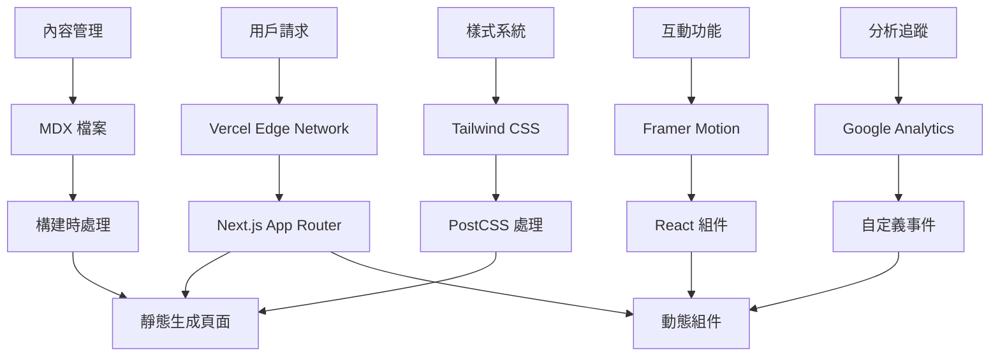

# 設計文件

## 概述

本設計文件描述了將 Orlo 官網從靜態 HTML 架構遷移到現代 SSG (Static Site Generation) 架構的技術方案，同時實現全新的「AI Chief of Staff」品牌定位和互動式用戶體驗。

## 架構

### 技術棧選擇

基於專案需求和現有技術環境，我們選擇以下技術棧：

**核心框架：Next.js 14**

- 理由：成熟的 React SSG 框架，優秀的性能和 SEO 支援
- 支援靜態生成和伺服器端渲染的混合模式
- 豐富的生態系統和社群支援
- 與現有 Tailwind CSS 和 JavaScript 生態系統完美整合

**樣式系統：Tailwind CSS 3.x**

- 保持現有的設計系統一致性
- 支援現代 CSS 功能如 CSS Grid、Flexbox
- 優化的生產構建和 purging

**動畫和互動：Framer Motion**

- 提供流暢的頁面過渡和元素動畫
- 支援手勢和拖拽互動
- 與 React 生態系統深度整合

**內容管理：MDX + 本地檔案系統**

- 支援 Markdown 內容管理
- 允許在 Markdown 中嵌入 React 組件
- 保持簡單的內容更新流程

**部署平台：Vercel + Firebase Hosting (備用)**

- Vercel 為 Next.js 提供最佳化的部署體驗
- 保留 Firebase Hosting 作為備用部署選項
- 支援自動 CI/CD 和預覽部署

### 架構圖



## 組件和介面

### 頁面結構

**主要頁面組件：**

1. **LandingPage** - 主著陸頁面
   - HeroSection - 英雄區塊與產品演示
   - AIConversationDemo - 互動式 AI 對話演示
   - MultiScenarioShowcase - 多角色場景展示
   - SocialProof - 社會證明和用戶見證
   - PricingSection - 定價和合作夥伴關係
   - CTASection - 最終行動呼籲

2. **PrivacyPolicy** - 隱私政策頁面
3. **TermsOfService** - 服務條款頁面

**共享組件：**

1. **Navigation** - 導航欄
   - 支援玻璃效果和滾動時的樣式變化
   - 響應式設計和行動裝置選單

2. **Footer** - 頁腳
   - 多欄位佈局
   - 社交媒體連結和法律頁面連結

3. **InteractiveDemo** - 互動式產品演示
   - 可拖拽的時間塊
   - 即時 AI 聊天模擬
   - 動畫效果和狀態管理

4. **AnimatedSection** - 動畫區塊包裝器
   - 滾動觸發動畫
   - 漸進式內容顯示

### 組件介面設計

```typescript
// 核心組件介面
interface HeroSectionProps {
  title: string;
  subtitle: string;
  ctaButtons: CTAButton[];
  metrics: Metric[];
  demoContent: DemoContent;
}

interface AIConversationProps {
  messages: ChatMessage[];
  isTyping: boolean;
  onMessageSend?: (message: string) => void;
}

interface ScenarioCardProps {
  persona: UserPersona;
  schedule: TimeBlock[];
  aiInsight: string;
  gradient: string;
}

interface TimeBlockProps {
  id: string;
  title: string;
  time: string;
  type: 'deep-work' | 'meeting' | 'admin' | 'personal';
  energyLevel: 'high' | 'medium' | 'low';
  isDraggable: boolean;
  onDrag?: (id: string, newPosition: number) => void;
}
```

## 資料模型

### 內容資料結構

**頁面內容模型：**

```typescript
interface PageContent {
  meta: {
    title: string;
    description: string;
    keywords: string[];
    ogImage: string;
  };
  hero: HeroContent;
  sections: Section[];
  cta: CTAContent;
}

interface HeroContent {
  badge: string;
  headline: string;
  subheadline: string;
  description: string;
  buttons: CTAButton[];
  metrics: Metric[];
}

interface Section {
  id: string;
  type: 'demo' | 'scenarios' | 'testimonials' | 'pricing';
  title: string;
  content: any; // 根據類型而定
  animation?: AnimationConfig;
}
```

**用戶角色和場景模型：**

```typescript
interface UserPersona {
  id: string;
  name: string;
  role: string;
  description: string;
  avatar: string;
  gradient: string;
  challenges: string[];
}

interface TimeBlock {
  id: string;
  title: string;
  startTime: string;
  endTime: string;
  type: TimeBlockType;
  energyLevel: EnergyLevel;
  color: string;
  description?: string;
}

interface AIInsight {
  type: 'optimization' | 'protection' | 'batching';
  message: string;
  icon: string;
}
```

### 配置和設定

**網站配置：**

```typescript
interface SiteConfig {
  name: string;
  description: string;
  url: string;
  ogImage: string;
  links: {
    app: string;
    login: string;
    support: string;
  };
  analytics: {
    googleAnalyticsId: string;
    customEvents: EventConfig[];
  };
  features: {
    abTesting: boolean;
    animations: boolean;
    interactiveDemo: boolean;
  };
}
```

## 錯誤處理

### 錯誤類型和處理策略

**1. 構建時錯誤**

- MDX 內容解析錯誤
- 圖片優化失敗
- 類型檢查錯誤

處理方式：

- 提供詳細的錯誤訊息和修復建議
- 實施漸進式構建，避免單點故障
- 設置 fallback 內容

**2. 運行時錯誤**

- 動畫載入失敗
- 第三方服務不可用（Google Analytics）
- 圖片載入失敗

處理方式：

- 實施 Error Boundaries
- 提供優雅的降級體驗
- 記錄錯誤並發送到監控服務

**3. 用戶體驗錯誤**

- 慢網路連接
- JavaScript 禁用
- 舊瀏覽器支援

處理方式：

- 實施漸進式增強
- 提供無 JavaScript 的基本體驗
- 使用現代瀏覽器功能檢測

### 錯誤處理組件

```typescript
// 全域錯誤邊界
class GlobalErrorBoundary extends React.Component {
  // 捕獲和處理 React 錯誤
}

// 載入狀態處理
const LoadingFallback = () => {
  // 提供載入中的用戶體驗
};

// 網路錯誤處理
const NetworkErrorHandler = {
  // 處理 API 調用失敗
  // 提供重試機制
};
```

## 測試策略

### 測試層級

**1. 單元測試 (Jest + React Testing Library)**

- 組件渲染測試
- 用戶互動測試
- 工具函數測試
- 覆蓋率目標：80%+

**2. 整合測試 (Playwright)**

- 頁面導航測試
- 表單提交測試
- 動畫和互動測試
- 跨瀏覽器相容性測試

**3. 視覺回歸測試 (Chromatic)**

- 組件視覺一致性
- 響應式設計測試
- 動畫狀態測試

**4. 性能測試 (Lighthouse CI)**

- 頁面載入速度
- Core Web Vitals
- SEO 分數
- 可訪問性檢查

### 測試自動化

```yaml
# GitHub Actions 工作流程
name: Test and Deploy
on: [push, pull_request]

jobs:
  test:
    runs-on: ubuntu-latest
    steps:
      - name: Run unit tests
      - name: Run integration tests
      - name: Run visual regression tests
      - name: Run performance audit

  deploy:
    needs: test
    runs-on: ubuntu-latest
    steps:
      - name: Deploy to Vercel
      - name: Update Firebase hosting (backup)
```

## 性能優化

### 載入性能

**1. 靜態生成優化**

- 預生成所有靜態頁面
- 圖片優化和 WebP 格式支援
- 字體預載入和顯示優化

**2. 代碼分割**

- 路由級別的代碼分割
- 動態導入重型組件
- 第三方庫的按需載入

**3. 資源優化**

- CSS 和 JavaScript 壓縮
- 樹搖優化移除未使用代碼
- CDN 分發靜態資源

### 運行時性能

**1. React 優化**

- 使用 React.memo 防止不必要的重渲染
- 實施虛擬滾動（如需要）
- 優化狀態管理和更新

**2. 動畫優化**

- 使用 CSS transforms 而非 layout 屬性
- 實施 will-change 提示
- 動畫幀率監控和調整

**3. 記憶體管理**

- 清理事件監聽器
- 優化圖片和媒體資源
- 實施懶載入策略

## 遷移策略

### 階段性遷移計劃

**階段 1：基礎架構建立**

- 設置 Next.js 專案結構
- 配置 Tailwind CSS 和基本樣式
- 實施基本的頁面路由

**階段 2：內容遷移**

- 轉換現有 HTML 內容到 React 組件
- 實施 MDX 內容管理系統
- 遷移圖片和靜態資源

**階段 3：互動功能實施**

- 開發互動式產品演示
- 實施動畫和過渡效果
- 整合 A/B 測試功能

**階段 4：優化和部署**

- 性能優化和測試
- SEO 和分析配置
- 生產環境部署

### 風險緩解

**1. 內容一致性**

- 實施內容驗證和比較工具
- 建立內容遷移檢查清單
- 設置 A/B 測試比較新舊版本

**2. SEO 影響**

- 保持 URL 結構一致
- 實施適當的重定向
- 監控搜索引擎排名變化

**3. 用戶體驗連續性**

- 漸進式功能發布
- 保留關鍵用戶流程
- 實施用戶回饋收集機制

## 部署和維護

### 部署流程

**1. 開發環境**

- 本地開發伺服器
- 熱重載和即時預覽
- 開發工具整合

**2. 預覽環境**

- 每個 PR 自動生成預覽
- 內容和功能驗證
- 利害關係人審查

**3. 生產環境**

- 自動化部署到 Vercel
- 健康檢查和回滾機制
- 監控和警報設置

### 維護策略

**1. 內容更新**

- 簡化的 MDX 編輯流程
- 內容版本控制
- 自動化內容驗證

**2. 功能迭代**

- 功能開關管理
- A/B 測試框架
- 用戶回饋整合

**3. 技術維護**

- 依賴更新自動化
- 安全漏洞掃描
- 性能監控和優化
